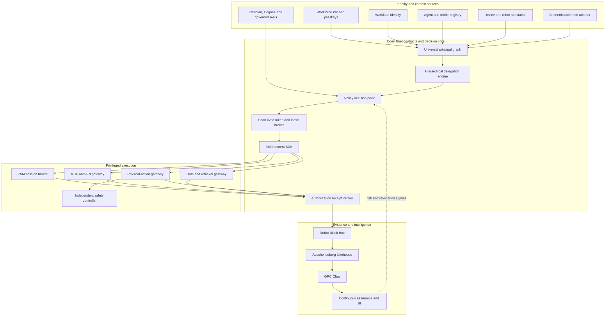

# Apex IAM/PAM Product Architecture

## Product category

AgentIAM is the authorization and evidence fabric for humans, AI agents, workloads and physical machines. It sits between identity providers and consequential effects. The open project defines portable contracts, policy behavior and conformance evidence. The commercial platform operates those controls at enterprise and sovereign scale.

The system never treats authentication as authorization. Every protected action binds an authenticated principal to an accountable owner, purpose, delegation chain, resource, action, environment, risk state, approval state, policy revision and evidence obligation.

## System architecture

## Trust zones and failure boundaries

| Zone | Authority | Required separation | Fail-closed condition |
|---|---|---|---|
| Root governance | Establish trust domains and recovery rules | Offline keys, quorum custody and independent audit | Missing quorum, stale ceremony or unverified release |
| Identity issuance | Bind identities to owners and tenants | Issuer separated from policy approval | Unknown owner, tenant conflict or failed attestation |
| Policy decision | Decide an exact request | Policy administration separated from runtime execution | Missing purpose, ambiguous resource, stale policy or excessive risk |
| Privileged execution | Mediate commands without exposing standing credentials | Session broker isolated from decision administration | Expired decision, command outside scope or revocation signal |
| Physical action | Issue a short-lived action lease | Identity authorization separated from independent safety controller | Missing attestation, unsafe state, unknown model or expired lease |
| Evidence | Preserve decisions and outcomes | Producer separated from witness and verifier | Broken chain, missing outcome or unauthenticated root |
| Analytics | Calculate risk and control effectiveness | Row, column and tenant isolation from operational stores | Unknown lineage, stale evidence or cross-tenant query |

## Normative contracts

### Universal principal

Every active identity has a type, accountable owner, trust domain, tenant, risk class, lifecycle state and provider attributes. Provider identifiers are aliases; the AgentIAM principal identifier remains stable across migrations.

### Hierarchical delegation

A delegation is a diminishing capability. A child cannot broaden the parent purpose, resources, actions, budget, approval requirement, data classification, geography or delegation depth. Revoking a parent invalidates every descendant.

### Authorization decision

The policy engine returns `ALLOW`, `DENY` or `REQUIRE_APPROVAL` plus a reason, expiry and enforceable obligations. Material effects receive short expiries and outcome-recording obligations. Decisions are evidence objects, not generic booleans.

### Physical-action lease

A physical lease is bound to one principal, robot, delegation, action, operating domain, model digest, policy revision and decision. The reference implementation caps its lifetime at 30 seconds. It never replaces collision avoidance, flight control, interlocks, brakes or emergency stops.

## Open project and commercial product

| Layer | Apache-2.0 open project | Commercial platform |
|---|---|---|
| Contracts | Schemas, versioning rules and test vectors | Managed schema registry and migration guarantees |
| Identity | Universal principal model and reference adapters | Production federation, lifecycle automation and proprietary estate connectors |
| Authorization | Deterministic engine and policy tests | Distributed HA decision plane, policy studio and staged rollouts |
| PAM | Synthetic JIT/JEA target and protocol contracts | Vault integration, session isolation, recording, rotation and command controls |
| Agent security | Delegation, MCP fixture and proof-of-possession tests | Fleet inventory, runtime gateway, budgets and multi-agent risk analytics |
| Context | Authorization-preserving retrieval contract | Supported Obsidian, Cognee, LangGraph and enterprise knowledge connectors |
| Biometrics | Synthetic signed-assertion interface and privacy tests | Certified vendor orchestration and template-vault integration |
| Physical AI | Action-lease schema, simulator and Robot Black Box bridge | Edge gateway, fleet operations, hardware attestation and supported platforms |
| Evidence | Local verifier, GRC Claw export and public score format | Iceberg lakehouse, retention, legal hold, trust portal and continuous assurance |
| Deployment | Compose and reference Kubernetes manifests | HSM/KMS, hardened operator, air-gap bundles, DR, upgrades and SLOs |

Security-critical verification remains open. Revenue comes from supported operation, regulated deployments, integration depth, assurance intelligence and transferred accountability.

## Control ownership

No vendor-wide hidden administrator is part of the design. Customer roots remain customer-controlled. Company control is retained through equity, board rights, trademarks, commercial licenses, release infrastructure, managed services, certified integrations and the hosted assurance network. Production recovery and release signing use recorded quorum custody.

## Evaluation baselines

| Domain | Primary measures | Release requirement |
|---|---|---|
| Identity | owner coverage, orphan rate, shared-secret rate | 100% owner coverage; zero orphaned production principals |
| Authorization | false allow, false deny, scope amplification | Zero known false allows and authority amplification in conformance corpus |
| Delegation | lineage coverage, descendant revocation latency | Complete lineage; measured p95 revoke-to-deny |
| PAM | standing privilege, recorded sessions, credential exposure | JIT by default; no target secret exposed where mediation is supported |
| Agents | tool-call attribution, budget enforcement, context leakage | Every material tool call attributed; zero cross-compartment retrieval in tests |
| Biometrics | liveness, quality, demographic error and lawful-purpose evidence | No biometric assertion alone authorizes a consequential action |
| Physical AI | lease expiry, safety-state freshness and evidence coverage | Independent safety control and complete action/outcome evidence |
| Evidence | verification success, freshness and reconstruction time | Tamper tests fail closed; incident timeline reproducible from retained evidence |
| Operations | p50/p95/p99 latency, availability, RTO and RPO | Targets published per deployment profile and proven by load/DR exercises |

## Release sequence

1. Freeze the four public contracts and publish compatibility fixtures.
2. Add asymmetric receipt signatures, rotation, revocation and externally anchored verification.
3. Implement OIDC/SCIM, SPIFFE, OPA/Cedar, MCP and Kubernetes reference adapters.
4. Deliver the autonomous-maintenance case study end to end.
5. Add Iceberg evidence tables and GRC Claw control envelopes.
6. Commission cryptographic, tenant-isolation and policy-bypass reviews.
7. Run a controlled enterprise pilot before making production assurance claims.
