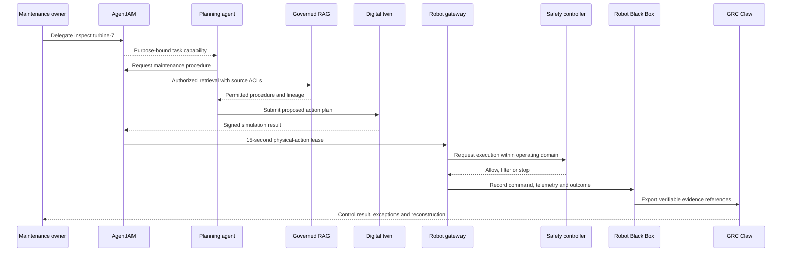

# Flagship Case Study: High-Assurance Autonomous Maintenance

## Demonstration objective

An AI maintenance swarm inspects a synthetic turbine using governed enterprise knowledge and a simulated robotic arm. The demonstration shows that every digital and physical effect remains attributable, purpose-bound, revocable and reconstructable.

## Participants

| Principal | Responsibility | Maximum authority |
|---|---|---|
| Maintenance owner | Approves the inspection objective | Delegate inspection within one asset and time window |
| Planning agent | Produce the inspection plan | Read approved procedures and request simulation |
| Diagnostic agent | Analyze synthetic telemetry | Read turbine telemetry; no actuator authority |
| Privileged execution agent | Stage the approved robot task | Submit one signed plan to the robot gateway |
| Digital twin | Evaluate the plan | Produce a signed simulation result |
| Robotic arm | Execute the bounded movement | Execute one leased action inside the test cell |
| Safety controller | Enforce independent physical limits | Stop or reject movement regardless of IAM decision |
| GRC Claw | Evaluate control evidence | Read normalized receipts and issue an assurance result |

## End-to-end sequence

## Required negative demonstrations

1. A child agent requests a broader action and is denied.
2. A copied token fails proof-of-possession validation.
3. A restricted knowledge chunk remains inaccessible after indexing.
4. One of two required approvers is absent and the request remains pending.
5. Device attestation is stale and no physical lease is issued.
6. Digital-twin evidence references a different model digest and the action is denied.
7. The parent delegation is revoked and every child token stops working.
8. The safety controller rejects a movement even though identity authorization succeeded.
9. A Robot Black Box event is modified and independent verification fails.
10. GRC Claw distinguishes missing evidence from evidence that a control failed.

## Evidence package

The final package contains:

- universal-principal records for every participant;
- the complete diminishing delegation chain;
- authorization requests, decisions and obligations;
- knowledge source references and retrieval decisions;
- digital-twin plan and result digests;
- the physical-action lease;
- safety-controller status and intervention evidence;
- Robot Black Box command, telemetry and outcome references;
- revocation and negative-test results;
- GRC Claw control mappings and assurance status;
- measured decision, revocation and reconstruction latency.

## Success gates

| Gate | Required result |
|---|---|
| Attribution | Every material action maps to one principal, owner and delegation chain |
| Least authority | No child, tool or robot receives authority outside the parent grant |
| Context isolation | Restricted sources remain inaccessible before and after indexing |
| Approval | High-consequence actions meet the configured quorum |
| Physical authorization | Lease is exact, model-bound, short-lived and non-replayable |
| Safety independence | Safety controller can override the authorization plane |
| Revocation | Parent revocation denies all descendant actions within the declared target |
| Evidence | Modification, deletion and reordering tests fail verification |
| Reconstruction | Reviewer can reconstruct purpose, decision, action and outcome from retained evidence |

The first public version should use synthetic identities, telemetry and biometric assertions. Production claims require independent review and deployment-specific evidence.
