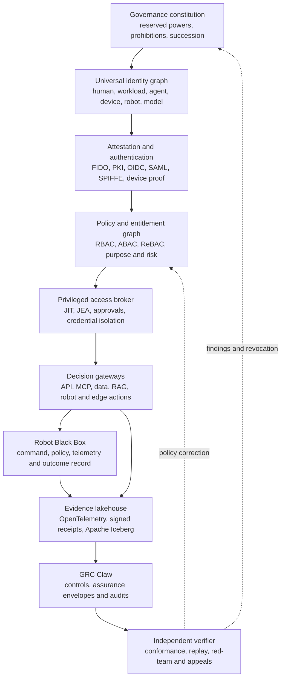

# Sovereign Identity Trust Fabric

## Product thesis

The Sovereign Identity Trust Fabric extends AgentIAM Lab from an agent conformance suite into a vendor-neutral control plane for **people, privileged administrators, workloads, AI agents, models, devices, vehicles and robots**.

Its defining property is not a universal administrator account. It is a verifiable chain of authority:

```text
owner -> purpose -> delegation -> identity -> policy -> approval -> action -> receipt -> review
```

Every material action must answer six questions:

1. Who or what acted?
2. Who delegated the authority?
3. For which declared purpose?
4. What policy and evidence allowed the action?
5. What happened, including the resulting state?
6. How can the authority be suspended, revoked and independently reviewed?

The open project should become the common language and conformance layer. A2Z SOC should commercialize the production operations, regulated deployments, managed assurance and integration network around it.

## Living-trust governance analogy

The analogy is an organizational design pattern, not a legal trust or a substitute for legal advice.

| Living-trust concept | System equivalent | Design consequence |
|---|---|---|
| Trust instrument | Signed governance charter and machine-readable control constitution | Powers, prohibitions and amendment rules are explicit |
| Settlor | Organization establishing a trust domain | Creates the domain but does not receive an invisible permanent backdoor |
| Trust corpus | Identities, policies, evidence, signing roots and protected resources | Assets are inventoried, classified and governed |
| Trustee | Policy administration authority | Operates within recorded duties and scoped powers |
| Trust protector | Independent security and continuity authority | Can suspend compromised governance without operating daily access |
| Beneficiaries | Users, customers, citizens and relying organizations | Rights, redress and service obligations are measurable |
| Distribution rules | Authorization and entitlement policies | Access is purpose-bound, conditional and time-limited |
| Successor trustee | Tested recovery and succession quorum | Loss or compromise of one executive cannot orphan the system |
| Accounting | Append-only authorization and action receipts | Decisions can be reconstructed and challenged |

## Reference architecture



### Plane 1: constitutional governance

- Versioned authority charter with machine-readable reserved powers.
- Separate policy administration, policy approval, key custody, audit and recovery duties.
- Quorum-controlled amendments and emergency suspension.
- Named data controller, model owner, identity owner and accountable business principal.
- Public claims and limitations registry so tests cannot be presented as certification.

### Plane 2: universal identity graph

Every actor receives a unique identity and lifecycle state:

- workforce, contractor, customer and citizen identities;
- privileged administrators and service-desk operators;
- applications, containers, workloads and service accounts;
- AI agents, child agents, models, tools and MCP servers;
- cameras, sensors, edge gateways and biometric terminals;
- vehicles, UAVs, humanoids, robotic hands and digital twins;
- datasets, RAG indexes, Obsidian vaults, Cognee graphs and LangGraph workflows.

Relationships retain ownership, purpose, tenancy, geography, risk class, parent delegation, environment and expiration. No machine identity can silently inherit the full authority of its human sponsor.

### Plane 3: proof and attestation

- Passkeys and phishing-resistant authentication for people.
- OIDC, SAML and SCIM for enterprise federation and provisioning.
- SPIFFE/SPIRE for short-lived workload identities and separated trust domains.
- Device posture, TPM or secure-element evidence where available.
- Model, agent package and policy artifact digests.
- Biometric matching only through replaceable adapters; store reference templates in a separately administered vault and expose a signed result with assurance level, purpose, freshness and liveness outcome.

Biometrics are an authentication signal, not an identity database entitlement. The policy engine must be able to deny access even after a biometric match.

### Plane 4: policy and entitlement graph

The normalized decision tuple is:

```text
subject + accountable principal + delegation + purpose + resource
        + action + environment + risk + evidence + obligations
```

The engine supports RBAC for understandable baselines, ABAC for context, ReBAC for ownership and delegation, and purpose-based rules for regulated data. Policy decisions return obligations such as approval, recording, redaction, rate limit, geographic restriction, human supervision or emergency stop readiness.

### Plane 5: privileged access management

- Just-in-time and just-enough privilege.
- Credential checkout only through a broker; target credentials are never exposed to agents when protocol mediation is possible.
- Dual approval for root, production, financial, biometric-watchlist and safety-critical privileges.
- Session proxying and command-level authorization.
- Short TTL, proof-of-possession binding and continuous revocation.
- Break-glass credentials held through quorum custody, with immediate evidence generation and mandatory post-event review.

### Plane 6: agentic and physical action gateways

Gateways sit immediately before the effect, not only at login:

- MCP tool calls and API operations;
- cloud, Kubernetes, database and SaaS administration;
- financial instructions and procurement approvals;
- retrieval from governed RAG and knowledge systems;
- camera search and biometric identification requests;
- VLA actions, robot skills, autopilot mode changes and digital-twin promotion.

For physical systems the gateway must preserve an independent safety controller, bounded operating domain and hardware emergency stop. The identity fabric must never become the sole safety mechanism or provide autonomous weapon targeting or release authority.

### Plane 7: context and data governance

- Source-level ACLs survive chunking, embedding, graph extraction and retrieval.
- Every retrieval carries principal, purpose, source lineage, sensitivity and retention metadata.
- LangGraph nodes receive task-scoped capabilities instead of shared service credentials.
- Obsidian and Cognee connectors default to local indexing and metadata minimization.
- Apache Iceberg tables separate identity events, policy decisions, sessions, evidence and cost telemetry; row and column controls prevent analytics from becoming a shadow identity store.

### Plane 8: evidence and assurance

Robot Black Box and AgentIAM emit the same minimum receipt vocabulary: actor, sponsor, delegation, intent, policy version, inputs, decision, approval, action digest, result digest, timestamps and integrity method. GRC Claw maps those receipts into control evidence and produces assurance envelopes for customers, auditors, regulators, insurers and procurement teams.

The evidence system distinguishes:

- configuration from observed operation;
- integrity from non-repudiation;
- successful tests from operating effectiveness;
- unavailable evidence from evidence of absence;
- simulation results from production results.

## Key hierarchy and continuity

There is no permanent hidden master key. Long-term control comes from a defensible governance and cryptographic hierarchy:

1. Offline root keys establish each trust domain.
2. Online intermediate issuers rotate frequently and have narrow purposes.
3. Tenant and environment keys remain isolated.
4. Production recovery requires a documented quorum, such as three of five custodians.
5. Emergency suspension uses a separate authority from recovery and cannot grant ordinary access.
6. Every issuance, recovery, rotation and revocation generates public-key-verifiable evidence.
7. Successor custody is rehearsed at least annually.

This preserves founder and board authority through lawful reserved matters, equity, trademarks and governance documents while preventing one stolen credential, coerced administrator or compromised executive account from owning the entire system.

## Standards baseline

The project should implement conformance profiles rather than claim universal certification:

- NIST SP 800-207 and CISA Zero Trust Maturity Model;
- NIST SP 800-63-4 digital identity guidance;
- OAuth 2.1, token exchange, OIDC, SAML and SCIM;
- OpenID AuthZEN and Shared Signals / CAEP;
- FIDO2 and WebAuthn;
- SPIFFE/SPIRE workload identity;
- OPA and Cedar policy adapters;
- OpenTelemetry and OSCAL evidence export;
- ISO/IEC 27001, ISO/IEC 42001, NIST AI RMF and relevant sector controls;
- Egyptian Personal Data Protection Law 151/2020 and current EG-CERT/NTRA requirements for Egyptian deployments;
- GDPR and eIDAS 2 profiles for European deployments.

Mappings provide traceability only. Certification and legal compliance require scoped independent assessment.

## Adoption phases and release gates

| Phase | Deliverable | Exit gate |
|---|---|---|
| 0. Specification | Identity, delegation, receipt and adapter schemas | Two independent implementations produce mutually verifiable receipts |
| 1. Lab | Deterministic conformance suite and vulnerable/controlled demos | False allow, authority amplification and cross-tenant success remain zero in the suite |
| 2. Enterprise pilot | IdP, SPIFFE, OPA/Cedar, Kubernetes and MCP adapters | Revocation, tenant isolation, recovery and audit reconstruction tested end to end |
| 3. Egyptian sovereign pilot | Arabic UX, air-gapped deployment, local HSM/KMS and PDPL evidence profile | Local counsel and independent security review; named operational owners |
| 4. Regional platform | Multi-entity federation, residency controls and partner operating model | Three production references in different regulated sectors |
| 5. International assurance network | Signed conformance registry and cross-domain trust | Independent governance and reproducible third-party certification profile |

## North-star measures

- 100% unique identity and accountable-owner coverage.
- 100% material actions with complete delegation and decision receipts.
- 0 successful authority-amplification, expired-token or cross-tenant tests.
- Measured p50, p95 and p99 authorization and revocation latency.
- Mean time to revoke all descendant authority.
- Percentage of privileged access that is just-in-time and recorded.
- Percentage of RAG retrievals preserving source authorization and purpose.
- Percentage of biometric requests with lawful purpose, minimization and review evidence.
- Percentage of physical actions linked to model, policy, operator and outcome evidence.
- Time and cost to onboard a new identity provider, PAM target, agent framework or robot platform.

